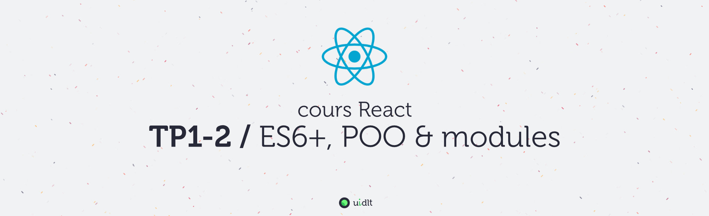

## Objectifs
- Maîtriser les syntaxes de la POO en ES6+
- Mettre en oeuvre les modules ES6
- Configurer un environnement de développement et les outils permettant de faire du JS moderne

## Sommaire
Pour plus de clarté, les instructions du TP se trouvent dans des fichiers distincts (un fichier par sujet), procédez dans l'ordre sinon, ça fonctionnera beaucoup moins bien !

1. [A. Préparatifs](A-preparatifs.md)
2. [B. Intégration du JS](B-integration.md)
3. [C. La POO](C-poo.md)
4. [D. Compiler avec Babel](./D-babel.md)
5. [E. Modules](E-modules.md)
6. [F. Pour aller plus loin : POO avancée](F-poo-avancee.md)

[Correction TP1](https://github.com/GuillaumeCar/react-tp1)

[Correction TP2](https://github.com/GuillaumeCar/react-tp2)

[TP suivant](https://github.com/GuillaumeCar/react-sujet-tp3)
